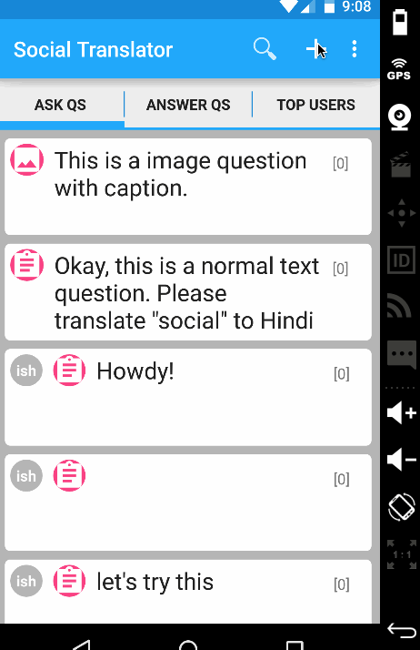

# Group Project - *Social Translator*

**Social Translator** is an android app.

Time spent: 30+ hours spent in total

## User Stories

The following stories are completed:

* [x] User can create a new account to Parse
* [x] User can log in with the Parse account
* [x] User can add the languages to the user profile (=Settings)
  * [x] User can add/remove their skills
  * [x] User can edit their nickname
* [x] User can ask other users to translate word(s) or sentence(s) in the first language into the second language.
  * [x] User sends simple texts.
  * [x] User can upload video/photo/sound recording.
* [x] User can seamlessly add friends
  * [x] User can follow friends
  * [x] User can view the questions from friends and  answer their questions

## Video Walkthrough 

Here's a walkthrough of implemented user stories:

### Asking a Question

### Answer a Question

### Push Notifications

Sending Phone:

Receiving Phone:

### Add Friends

### Answer to a question from my friend

### Add Skills

GIF created with [LiceCap](http://www.cockos.com/licecap/).

## Notes

Describe any challenges encountered while building the app.

## Open-source libraries used

- Let's add all the open-source libraries here

## License

    Copyright [2016] [Elanchezhiyan Elango, Hyunji Kim, Ishan Pande]

    Licensed under the Apache License, Version 2.0 (the "License");
    you may not use this file except in compliance with the License.
    You may obtain a copy of the License at

        http://www.apache.org/licenses/LICENSE-2.0

    Unless required by applicable law or agreed to in writing, software
    distributed under the License is distributed on an "AS IS" BASIS,
    WITHOUT WARRANTIES OR CONDITIONS OF ANY KIND, either express or implied.
    See the License for the specific language governing permissions and
    limitations under the License.